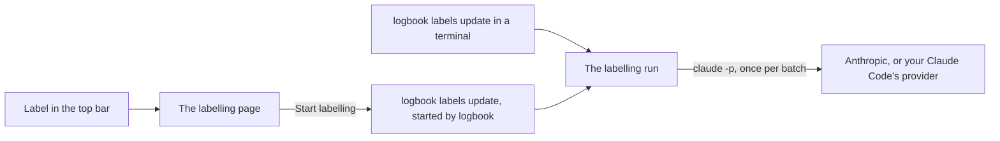

# How labelling works

Some of the dashboard's cards say what a conversation was for, how it ended and how you and the agent reacted to each other. Those answers are labels. Rules make some of them on every sync; a model makes the rest, only when you start it, through your own Claude Code.

## Rule labels

On every sync, rules label on your computer, at no cost:

- what a shell call was for, such as running tests or installing packages;
- why a failed call failed, for the tools other than the shell;
- whether the agent recovered after a failed call;
- who started a session: you, or an agent.

These labels are rebuilt on every sync. Cards that read them work before you label anything.

## Model labels

Six tasks need a model. Each feeds its cards:

| Task           | Labels                                                                   | Feeds                                                                                                                                                        |
| -------------- | ------------------------------------------------------------------------ | ------------------------------------------------------------------------------------------------------------------------------------------------------------ |
| `shell`        | What each shell call was for, and why a failed one failed                | <Ui page="/">Tool problems</Ui>, <Ui page="/">Unusually slow calls</Ui>, <Ui page="/">Calls that went wrong</Ui>                                             |
| `tool-failure` | Why a failed call of another tool failed, where the rules could not tell | <Ui page="/">Tool problems</Ui>, <Ui page="/">Calls that went wrong</Ui>                                                                                     |
| `session`      | What each conversation was for                                           | <Ui page="/">Conversations by goal</Ui>, <Ui page="/">Tokens per conversation</Ui>, <Ui page="/">Time per turn</Ui>, <Ui page="/">Time per conversation</Ui> |
| `outcome`      | How each conversation ended, with a note                                 | <Ui page="/">Finished</Ui>, <Ui page="/">Didn't finish</Ui>                                                                                                  |
| `prompt`       | What each of your prompts did, and how you reacted to the agent          | <Ui page="/">Reactions to the agent</Ui>                                                                                                                     |
| `reply`        | How the agent's last reply before your next prompt treated you           | <Ui page="/">Reactions from the agent</Ui>                                                                                                                   |

Until a model has labelled your sessions, those cards say so:

<Shot id="not-labelled" caption="The dashboard before any model labels." />

Labelled, the reaction cards show how you and the agent dealt with each other, week by week:

<Shot id="reactions-card" />

<Shot id="agent-reactions" />

## Starting a run

Nothing labels on its own after a sync. You start a run in one of two ways:

- In a terminal:

  ```sh
  logbook labels update
  ```

- In Log Book's page: <Ui page="/">Label</Ui>, next to the sync control, opens the labelling page. The page shows what a run would send: the model, the records it would label per task and per agent, and an estimate of the tokens, as `logbook labels plan` reports them. Its Start labelling button runs `logbook labels update`, which the page follows and can stop.

<Shot id="sync-control" caption="The sync control and the Label control in the top bar." />

The labelling page has no picture here: a demo host has no `claude`, so it shows only that it needs Claude Code.



## Your own Claude Code

A run labels through your own Claude Code: it starts `claude -p` once per batch, signed in as you, so the requests count against your Claude plan like your own sessions. Log Book never sees your login. Before it starts, a run says which `claude` it uses, how it is signed in and which model it runs on. When `ANTHROPIC_API_KEY` is set, it warns that Claude Code may bill the run to that key instead of your plan.

There is no local model, no model download and no other way to label: a model label comes from Claude through your `claude`, or not at all.

## The model

One model labels a whole run: the one you pass with `--model`, or Claude Haiku (<Fact name="defaultModel" />), the cheapest current Claude model, when you pass none. The `--model` help says what that choice trades:

<!--@include: ../.generated/model-option.md-->

So with Haiku, the praise line of <Ui page="/">Reactions to the agent</Ui> reads lower than Sonnet's labels would make it.

To choose another model, pass its full id, not an alias such as `sonnet`:

```sh
logbook labels update --model claude-sonnet-5-5
```

Log Book keeps no list of models and remembers no choice. A later `logbook labels update` with another model labels only the records no model has labelled yet.

## Relabelling with another model

To see how another model labels what you already have, label one task again with it, compare the two, and drop the labels you do not keep:

```sh
logbook labels run --task prompt --model claude-sonnet-5-5
logbook labels compare --task prompt --first claude-haiku-4-5 --second claude-sonnet-5-5
logbook labels drop --task prompt --labeller claude-haiku-4-5
```

`logbook labels compare` prints how often the two agree, field by field, and the disagreements they have most often. Reports read each record's newest model label, so drop the labeller you did not choose.

## Stopping and resuming

A run keeps every batch it finished, however it stops: Ctrl+C in the terminal, Stop on the labelling page, stopping `logbook`, your Claude usage limit, or a killed process. The next run continues where it stopped. In a terminal, Ctrl+C prints how far it got:

```text
Labelling stopped: 120 of 400 records labelled and kept. Run the same command again to continue.
```

A session's outcome and its last reply wait until the session has been quiet for an hour, so a run does not label a conversation that is still going.

## Labelling and maintenance

A labelling run, `logbook labels drop`, and the commands that rewrite the warehouse, `logbook compact` and `logbook forget`, never run at once.

A labelling run started while `logbook compact` runs stops before any model call and records no run, so it spends nothing. `logbook labels drop` meets the same line before it deletes a row:

```text
Maintenance is running on this warehouse: logbook compact is rewriting it (pid 4242, lock file ~/.local/share/log-book/warehouse.db.labels.lock). Run this again once it has ended. If none is running, delete that file.
```

Meanwhile the Label control reads `Labelling waits: logbook compact is rewriting the warehouse (since 2 min).` and offers no Start.

A compaction or a forget started while labelling runs is refused before it changes a byte:

```text
A labelling command is running on this warehouse, a labelling run or a logbook labels drop (pid 4242, lock file ~/.local/share/log-book/warehouse.db.labels.lock). Compacting rewrites the whole file: run this again once it has ended. If none is running, delete that file.
```

[What it sends](/labelling/what-it-sends) shows what each request holds.
