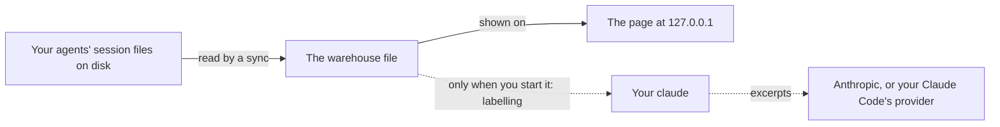

# Privacy and security

<!--@include: ./statement.md-->



## The page on your machine

Log Book serves its page on `127.0.0.1` only, with no login, so while it runs any user of the same machine can open it, as with any local server. The warehouse file itself can be read only by you. The page accepts changes, such as starting a sync or a labelling run, only from its own pages, so another website open in your browser cannot trigger them.

## How to check it

Three checks cover most of it:

- **Preview what labelling would send.** `logbook labels preview --task <task>` prints the exact text of the next batches without sending anything, and names the framing Claude Code adds:

  ```sh
  logbook labels preview --task shell
  ```

- **Run it offline.** Turn the network off, run `logbook`, wait for the first sync and use the pages. Everything works; only model labelling fails, at Claude Code's first request.
- **Look at its sockets.** While `logbook` runs, `lsof -nP -i -a -p <pid of logbook>` (macOS and Linux) lists only a `LISTEN` on `127.0.0.1:<port>` and loopback connections from your browser. On Linux, `ss -tnp` filtered for the process shows the same.

And for labelling itself:

- During labelling, `ps` shows `claude -p` children of the labelling process, each with `--model` and the model you chose. Outside a labelling run there are no `claude` processes.
- With a per-application firewall (Little Snitch, LuLu, OpenSnitch), the only outbound connections are those of `claude`, to its API host, during labelling; none during the version and login checks.
- After labelling, no new session for a temporary directory appears in Claude Code's `projects` folder or in Log Book's conversation list.

## What each request contains

Each labelling request holds a batch of items, and each item holds these parts of a record, in this order, each cut to its clip size. Nothing is redacted.

<!--@include: ../.generated/item-contents.md-->

With the items go the task's one-line system text and its fixed instructions, about 1 to 4 KB per task, and the lines Claude Code adds itself, listed above.

## Audit notes: where the code can reach the network

The one call site that can reach the network is starting `claude` for labelling. The others are local: the server on `127.0.0.1`, the child processes Log Book starts, and the tools the repository's own build runs. A CI check fails the build when a call site appears that this list does not name.

<!--@include: ../.generated/call-sites.md-->

## This website

The site sets no cookies, runs no analytics and loads nothing from another origin. GitHub Pages serves it and, like any web host, receives each visitor's IP address and request, under [GitHub's privacy statement](https://docs.github.com/en/site-policy/privacy-policies/github-general-privacy-statement).
