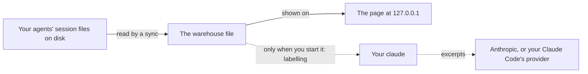

# What Log Book sends, and where

<!--@include: ./statement.md-->



## How to check it

| Claim                                                               | How to check                                                                                                                                                                                                                                                                                                                                                                                         |
| ------------------------------------------------------------------- | ---------------------------------------------------------------------------------------------------------------------------------------------------------------------------------------------------------------------------------------------------------------------------------------------------------------------------------------------------------------------------------------------------- |
| The only open sockets are on 127.0.0.1                              | While `logbook` runs: `lsof -nP -i -a -p <pid of logbook>` (macOS and Linux) lists only a `LISTEN` on `127.0.0.1:<port>`, and loopback connections from your browser. On Linux also `ss -tnp` filtered for the process.                                                                                                                                                                              |
| Sync, the page and rule labels need no network                      | Turn the network off, run `logbook`, wait for the first sync, use the pages. Everything works; only model labelling fails, at Claude Code's first request.                                                                                                                                                                                                                                           |
| Model requests come from Claude Code only, and only while you label | During labelling, `ps` shows `claude -p` children of the labelling process (the `logbook labels update` you typed, or the one the host started when you pressed Start), each with `--model` and the model you chose; with a per-application firewall (Little Snitch, LuLu, OpenSnitch) the only outbound connections are those of `claude`. Outside a labelling run there are no `claude` processes. |
| What a request contains                                             | `logbook labels preview --task <task>` prints the task's system line and the exact text of the next batches without sending them, and names the framing Claude Code adds.                                                                                                                                                                                                                            |
| Claude Code sends nothing else of its own                           | With a per-application firewall, `claude` connects only to its API host during labelling, and not at all during the version and login checks.                                                                                                                                                                                                                                                        |
| Claude Code keeps no history of the calls                           | After labelling, no new session for a temporary directory appears in Claude Code's `projects` folder or in Log Book's conversation list.                                                                                                                                                                                                                                                             |
| The code has no other network call                                  | The published packages' source can be searched: the one call site that can reach the network is starting `claude` in the engine's Claude client; the table below names its file, and a CI check keeps that true.                                                                                                                                                                                     |

For example, to see what the next batch of the shell task would send:

```sh
logbook labels preview --task shell
```

## Where the code makes network calls

<!--@include: ../.generated/call-sites.md-->

## This website

The site sets no cookies, runs no analytics and loads nothing from another origin. GitHub Pages serves it and, like any web host, receives each visitor's IP address and request, under [GitHub's privacy statement](https://docs.github.com/en/site-policy/privacy-policies/github-general-privacy-statement).
